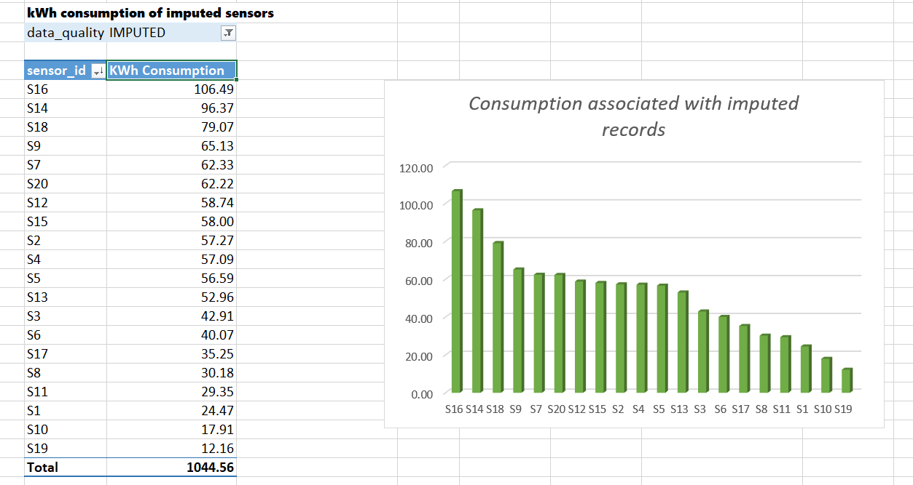
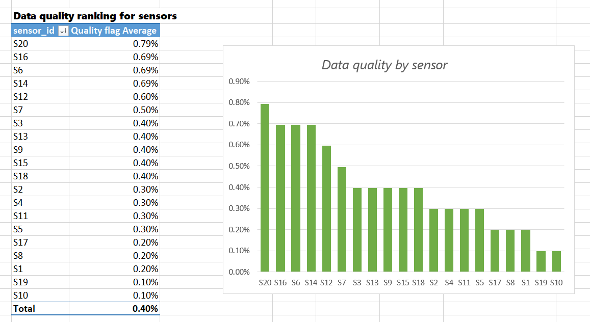
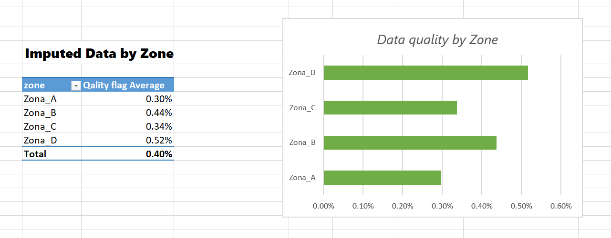
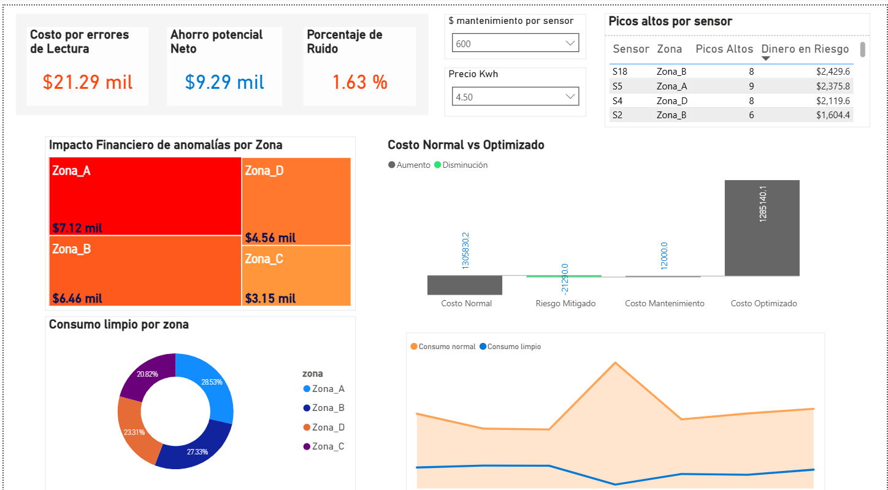
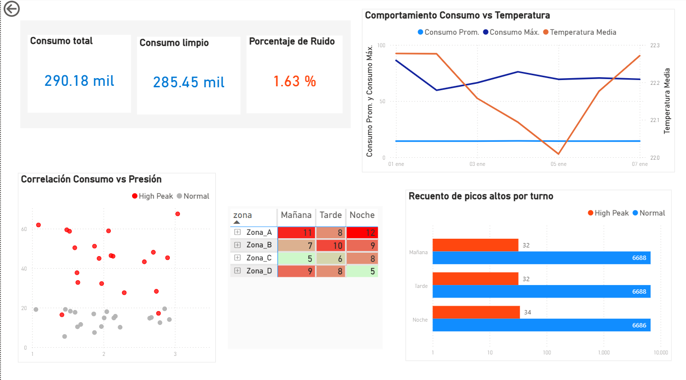
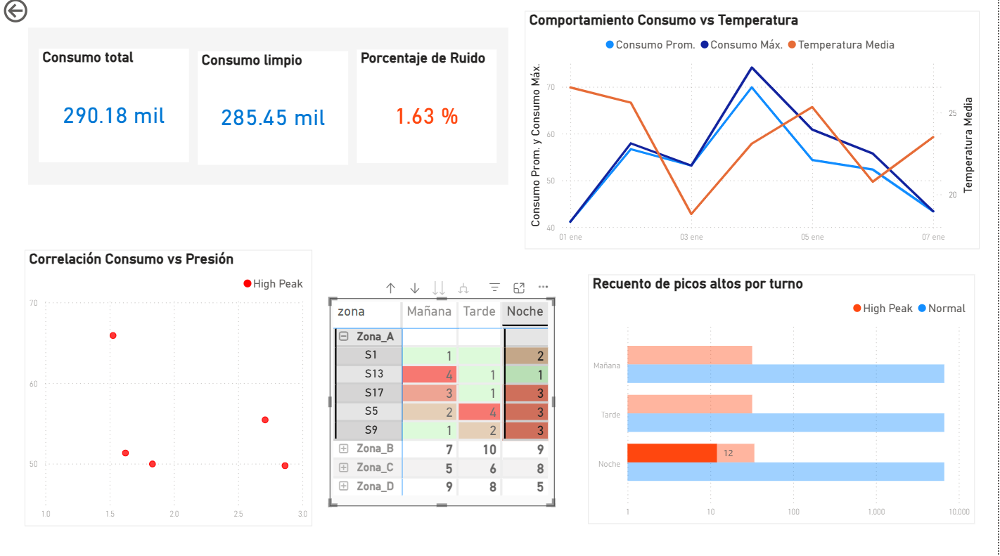
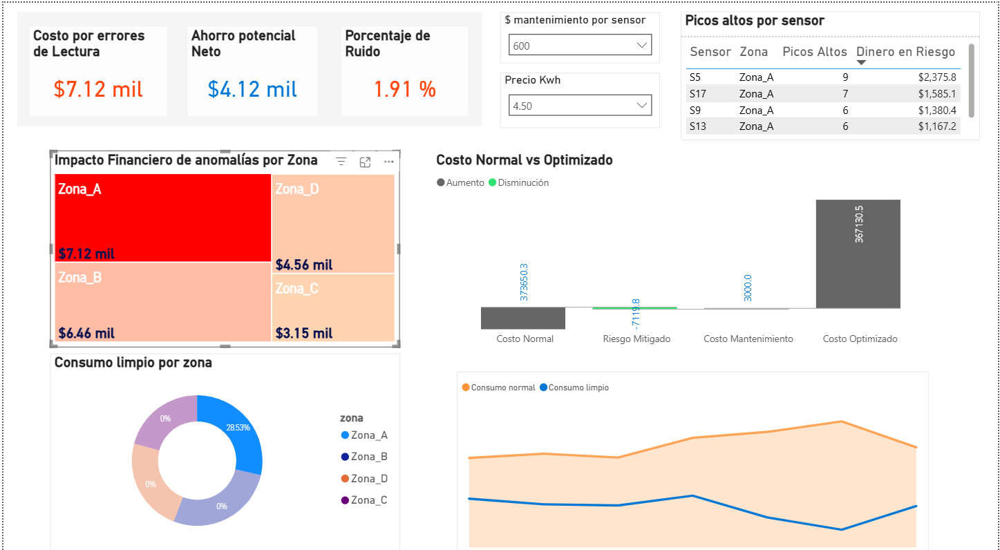

# Sensor-Data-Analysis

End-to-end analysis of sensor data to detect anomalies, evaluate data quality, and estimate potential financial impact.

The main goal of this project is to distinguish between real high-consumption events and false signals caused by data quality issues.

---

## Project Workflow

Raw Data → SQL Analysis → Data Cleaning (Excel) → Data Model → Power BI Dashboard → Insights

---

## SQL Analysis

### Scope

Exploratory and diagnostic analysis.

### Objectives

- Identify abnormal consumption patterns
- Detect potential anomalies
- Evaluate data quality issues

### Key Steps

- Null value analysis
- Duplicate detection
- Distribution and range validation
- Detection of extreme consumption spikes
- Context analysis using temperature, pressure, and flow
- Data cleaning and filtering
- Anomaly detection using window functions (LAG, ROW_NUMBER)

### Key Findings

- Consumption spikes up to 5-6x above average were detected
- Temperature, pressure, and flow do not show consistent changes during these spikes
- A large portion of anomalies is concentrated in Zona_B
- The behavior of these spikes is not supported by temperature, pressure, or flow, which points to sensor inconsistencies.

### Data Quality Notes

- Missing values found in temperature and pressure
- No duplicate records detected
- Extreme values have a strong impact on average-based analysis

---

## Excel Analysis

- Missing values were handled using average per sensor (imputation)
- Created a **data_quality** column (IMPUTED vs REAL)
- Created a **quality_flag** (1 = imputed, 0 = original)
- Evaluated data quality by sensor and zone
- Identified sensors with higher imputation rates
- Analyzed consumption linked to imputed records

**Note:**

Imputed data represents ~0.4% of the dataset. While low, imputation may reduce variability and should be considered when interpreting results.

---

## Data Model

Star schema:

- fact_readings - main measurements
- dim_sensor - zone information
- dim_time - time attributes (day, hour, shift)

---

## Power BI Analysis

The cleaned dataset was used to build interactive dashboards focused on anomalies, data quality, and financial impact.

### KPI Monitoring

**Note:** Dashboard labels follow the original dataset language (Spanish).

- Total Consumption vs Clean Consumption
- Noise Percentage (1.63%)
- Estimated cost impact

---

### Anomaly Detection Approach

Initial methods using average and standard deviation were tested but showed limitations due to sensitivity to extreme values.

IQR was selected as a more robust approach to detect high consumption spikes, as it reduces the influence of extreme values when defining anomaly thresholds.

This approach reduces the influence of extreme values when defining anomaly thresholds.

---

### Validation of Anomalies

To verify whether spikes were real:

- Consumption was compared against temperature, pressure, and flow
- No consistent relationship was observed during peak events
- High consumption without changes in related variables suggests these events are not physically supported

This indicates that the detected anomalies are driven by sensor issues rather than actual consumption.

---

### Financial Impact

- Estimated financial risk: ~$21.29k
- Potential savings after mitigation: ~$9.29k

Dynamic parameters:

- kWh price
- Maintenance cost per sensor

This allows simple scenario analysis based on different cost assumptions.

---

### Insights by Zone and Time

- Zona_B shows the highest concentration of anomalies
- Night shift presents more unstable behavior
- Filtering by zone reveals different risk patterns and sensor behavior

---

## Business Implications

- Sensor inconsistencies can lead to overestimation of consumption
- Data quality directly impacts financial analysis
- Zona_B should be prioritized for inspection
- Sensors with higher anomaly rates should be reviewed first

---

## Recommended Actions

- Inspect and recalibrate sensors in high-anomaly zones
- Implement basic data validation rules for extreme values
- Monitor anomalies by shift (focus on Night Shift)
- Re-evaluate financial impact after corrective actions

---

## Conclusion

Some high-consumption events initially appeared critical, but further analysis shows that many are not supported by related variables.

These results show that the detected anomalies are not supported by flow, pressure, or temperature patterns and are more consistent with data quality issues than real consumption.

The project highlights the importance of validating data before making operational or financial decisions.

---

## Tools

- SQL (DBeaver)
- Microsoft Excel
- Power BI
- Git & GitHub

---

## Status

Scaling and automation in progress.
